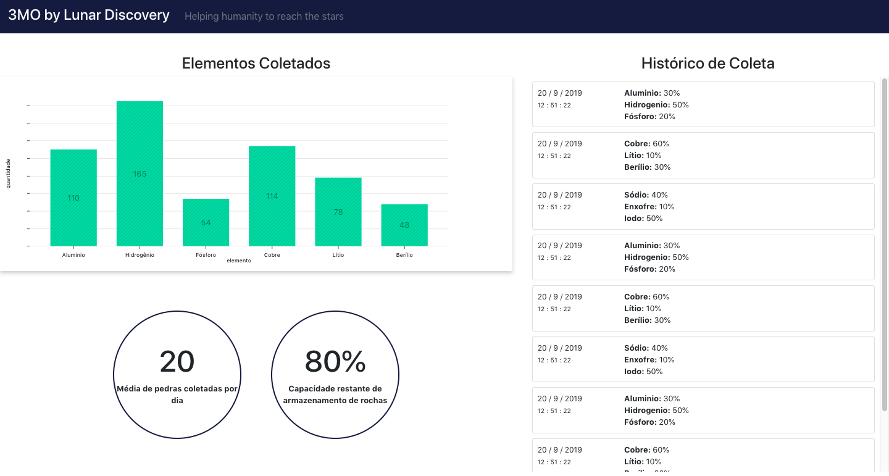
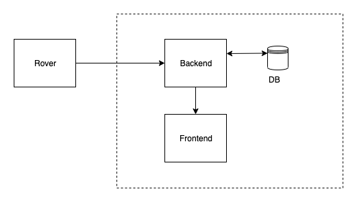

# 3MO
## Summary

* [About the Software](#about-the-software)
* [Architecture](#architecture)
  * [Technologies Used](#technologies-used)
* [Technical Details](#technical-details)
  * [Spectroscopy](#scpectroscopy)
  * [X-Ray](#x-ray)
* [How to run](#how-to-run)

## About the Software

This project is made by Lunar Discovery group during the Nasa Space Apps Hackathon in Brasília, inspired by the ["Eeny, Meeny, Miney, Sample!"](https://2019.spaceappschallenge.org/challenges/our-moon/eeny-meeny-miney-sample/details) challenge.

3MO is a project with a embedded Deep Learning software that allows moon rovers in the decision making process of which soil sample to collect. The project also has a web interface that makes it possible to track the collected data from earth.



## Architecture



The project is composed of three services: Rover, Backend and Frontend.

**Rover:** This service is where the Deep Learning software acts. It is installed in the moon rover and uses spectroscopy to examine the content of each sample and find it's composition. With the content of the sample the rover runs the algorithm to choose between taking it or not.

The rover makes daily updates on backend to save all the collected date on the data base.

**Backend:** The backend is an API where all the logs of what is being taken by the rover are saved.

**Frontend:** In the frontend all the specifications of what the rover is collecting is shown. The cientists can analyse the data from earth and see the what elements each sample has, and the percentage of each element is being taken. The cientists can also see the amount of space left to the rover carry new samples.

### Technologies used
To develop this project, the following technologies are being used:

* ReactJS - A JavaScript framework used to develop the frontend service
* Django REST - A Python framework used to developed the API
* SQLite - Database used for saving the collected data.

The Rover service couldn't be finished by the time of the project submission. The Deep Learning algorithim was planned to be made in Python. 

## Instruments used

We pretend to use already available hardware in order to obtain relevant data used to classify the samples.

### Spectroscopy

One of the instruments used will be the spectroscopy. 

## How to run
Run the project by following the steps:

* Run the API:

    To run the API run the command bellow. 

    ``` sh
    docker-compose up
    ```
    After the container is built the API it will be accessed on `localhost:8000`.

* Run the frontend:
    Open the project on the `frontend` folder and run the commands:
    
    ``` sh
    npm install
    npm start
    ```

    The project will be available on `localhost:3000`.
